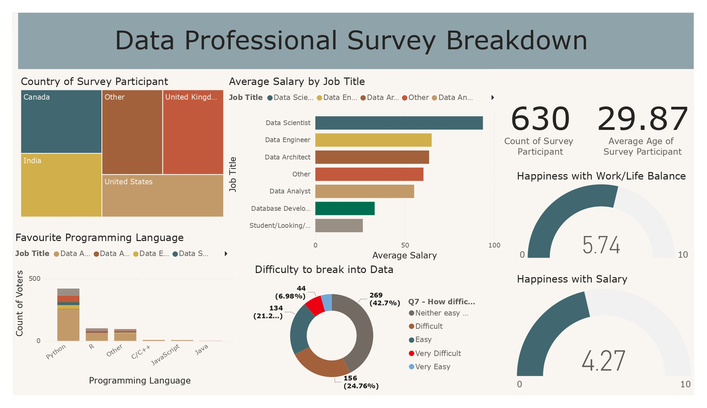

# Power BI – Data Professional Survey Analysis

🔗 **View the interactive report on Power BI Service:**  
https://app.powerbi.com/groups/me/reports/17380607-5f9c-4458-a526-0b78c7154813/7fc2d794e443c5bb6ea7?experience=power-bi

This project presents an interactive Power BI dashboard built using survey responses from data professionals around the world. The goal of the analysis is to explore career trends, salary differences, job satisfaction, and skills commonly used in the data industry.

---

## Report Overview
The dashboard provides insights into:

- **Country of survey participants**
- **Average salary by job title**
- **Favourite programming languages**
- **Difficulty of breaking into data roles**
- **Work/life balance satisfaction**
- **Salary satisfaction**
- **Participant demographics (count and average age)**

---

## Tools Used
- Power BI Desktop
- Power BI Service
- Excel (survey data source)

---

## Screenshot

---

## Key Insights
- Data Scientists report the highest average salaries among surveyed roles.
- Python is the most popular programming language among data professionals.
- Many respondents report that breaking into data roles is neither easy nor extremely difficult.
- Overall work/life balance satisfaction is higher than salary satisfaction.
- Survey participants come from a wide range of countries, indicating global representation.

---

## Notes
The dataset used for this dashboard is not included in this repository due to file size limitations.  
A screenshot of the report is provided for quick reference.

---

## Next Steps
This analysis could be expanded by:
- Comparing responses across experience levels
- Segmenting results by region
- Adding time-based trends if longitudinal data becomes available
